# Schematic problem tree

Internal architecture. Not a user-facing page.

We are not trying to make a prettier Tube map by iterating until the drawing looks right. We are naming the layers of the problem so each one can be solved, swapped, or reused without dragging the others along.

## Thesis

**Schematic, not topographic.** Station order, permitted movements, and hub identity. Not lat/lng except as a later compaction hint. Geographic and “LLM Bloom” style maps already exist; that is not the gap.

**London is line-not-service.** One colour is one line. Local/express is rare and a special case. If services share most of the track, they are one graph line. Overground and DLR sub-colours are paint, not a different graph. NYC’s local/express trunk model is a different city adapter, later.

**London first, layers reusable.** When we special-case London we still cut the work at these boundaries so another city can swap graph identity, marks, or codes without rewriting joins.

Roberts still needs a proper read and interviews later. What he has already published is enough to stop treating 45° as the goal. Octilinearity is a technique. The goal is a readable path: few false crossings, honest junctions, compressed outer branches, a centre that still feels like London.

- Roberts, M.J. *Underground Maps Unravelled* (2012); *Underground Maps After Beck* (2005).
- Roberts, M.J. & Newton, E.J. Schematic maps and wayfinding. *Cartography and Geographic Information Science*, 2015.
- Experiments and maps: [tubemapcentral.com](http://www.tubemapcentral.com/).

## Terrain

```mermaid
graph TD
  ROOT["Schematic diagram"] --> GRAPH["Graph identity"]
  ROOT --> VERTEX["Vertex geometry"]
  ROOT --> STRIP["Strip / segment"]
  ROOT --> LAYOUT["Layout and compaction"]
  ROOT --> PAINT["Paint and style"]

  GRAPH --> G1["Line vs service"]
  GRAPH --> G2["Shared-track family"]
  GRAPH --> G3["Branches from ordered routes"]

  VERTEX --> V1["Movement matrix"]
  VERTEX --> V2["Y / fork / peel"]
  VERTEX --> V3["Independent corridors"]
  VERTEX --> V4["Walking bond / interchange"]
  VERTEX --> V5["High-degree stagger"]

  STRIP --> S1["Segment + station marks"]
  STRIP --> S2["Joins"]
  STRIP --> S3["H then V"]
  STRIP --> S4["Arm spacing"]

  LAYOUT --> L1["One line"]
  LAYOUT --> L2["Shared-track family"]
  LAYOUT --> L3["One line with branches"]
  LAYOUT --> L4["All lines"]
  LAYOUT --> L5["Centre faithful / outer squash"]

  PAINT --> P1["Tick / ring / square / L / codes"]
  PAINT --> P2["Interchange bond"]
  PAINT --> P3["Line colour + Overground sub-colours"]
  PAINT --> P4["Name, National Rail, airport"]
  PAINT --> P5["River and other geo-markers"]
```

Solve down a column, not across the whole map. Crossing lines, hubs, and interchange history are vertex + paint, not a new graph model. Letter–number station codes (Taipei Y/O) sit in paint, for cities whose names are hard to read in Latin script.

## Merge ladder

Drawings get harder in this order. Always H, then V, before the next rung.

1. **One line** — path of degree-2 stations plus termini.
2. **Shared-track family** — Circle / Hammersmith & City / Metropolitan as one graph, still one “line” in the London sense.
3. **One line with branches** — Northern, District. Vertex decomposition starts here.
4. **All lines** — crossings, global layout. Last.

## What is already on this branch

| Layer | Where | Note |
|-------|--------|------|
| Marks, labels, stems, bonds | `lib/tfl/diagram-atoms.ts`, `/drafts/diagram-atoms` | Proof surface. Vertex must import, not redraw. |
| Movement matrix → Y / split | `lib/tfl/investigate/vertex-scenarios/`, `/drafts/vertex-scenarios` | Catalogue, not the network renderer. |
| Live Route/Sequence junctions | `/docs/drawing-the-line` | Diagnostic. |
| Horizontal strip, staggered Y | `lib/tfl/geometry/branch-strip-*.ts` | Energy layout, not a trunk guess. |
| Line schematic model | `lib/tfl/line-schematic.ts` | Lane × pos; orientation-specific. |

Stop expanding vertex-scenarios until a named slice below is the job. The try-until-it-draws loop is closed.

## Not now

- NYC service identity (local vs express as graph).
- Taipei-style codes; airport / National Rail labels as first-class layout.
- Full network; river; zone overlays.
- Picking octilinear vs curvilinear. Keep vertex geometry angle-agnostic.

## Next slices (one at a time)

1. Shared-track family on one graph (Circle / H&C / Met). Data already exists in tfl-ts (`SHARED_TRACK_LINE_SETS`).
2. Northern as one strip with two branch groups, using the vertex catalogue we already have.
3. H then V on that multi-branch strip; label clearance in both orientations.
4. Walking bonds (Bank–Monument) via `interchangeBondBox` on the strip, not a new mark.
5. Centre vs outer compaction — use placement scoring as a layout input, not a debug overlay.
